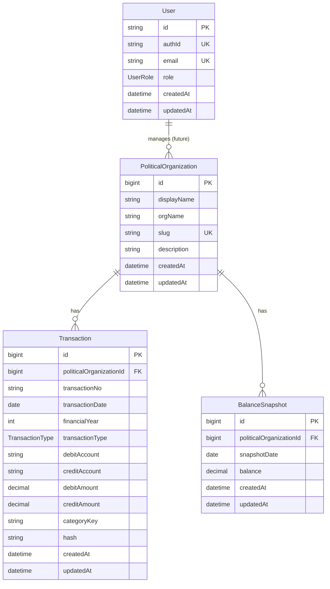

# データモデル

## 概要

政治資金ダッシュボードで使用する主要なデータモデルを定義します。これらはPrismaスキーマと対応しています。

## 1. PoliticalOrganization（政治団体）

政治家や政治団体の情報を管理するモデル。

### スキーマ

```typescript
interface PoliticalOrganization {
  id: string;              // BigInt（文字列としてシリアライズ）
  displayName: string;     // 表示名（例: "山田太郎"）
  orgName: string | null;  // 団体名（例: "山田太郎後援会"）
  slug: string;            // URLフレンドリーな識別子（例: "yamada-taro"）
  description: string | null; // 説明文
  createdAt: Date;         // 作成日時
  updatedAt: Date;         // 更新日時
}
```

### 制約
- `slug` はユニーク（一意）
- `displayName` は必須
- `slug` は必須

### 用途
- URLパスでの政治団体識別（`/politicians/{slug}`）
- トランザクションの紐付け
- データ集計の単位

---

## 2. Transaction（取引）

会計トランザクション（収入・支出）を管理するモデル。

### スキーマ

```typescript
interface Transaction {
  id: string;                          // BigInt（文字列としてシリアライズ）
  politicalOrganizationId: string;     // 所属する政治団体ID
  transactionNo: string;               // 取引番号（MFクラウドの取引No）
  transactionDate: Date;               // 取引日
  financialYear: number;               // 会計年度
  transactionType: TransactionType;    // 取引種別
  
  // 借方情報
  debitAccount: string;                // 借方勘定科目
  debitSubAccount: string | null;      // 借方補助科目
  debitDepartment: string | null;      // 借方部門
  debitPartner: string | null;         // 借方取引先
  debitTaxCategory: string | null;     // 借方税区分
  debitAmount: number;                 // 借方金額（Decimal(15,2)）
  
  // 貸方情報
  creditAccount: string;               // 貸方勘定科目
  creditSubAccount: string | null;     // 貸方補助科目
  creditDepartment: string | null;     // 貸方部門
  creditPartner: string | null;        // 貸方取引先
  creditTaxCategory: string | null;    // 貸方税区分
  creditAmount: number;                // 貸方金額（Decimal(15,2)）
  
  // メタ情報
  description: string | null;          // 備考
  memo: string | null;                 // メモ
  label: string;                       // ラベル（デフォルト: ""）
  friendlyCategory: string | null;     // フレンドリーカテゴリ
  categoryKey: string;                 // カテゴリキー（必須）
  hash: string;                        // ハッシュ値（重複チェック用、デフォルト: ""）
  
  createdAt: Date;                     // 作成日時
  updatedAt: Date;                     // 更新日時
}
```

### TransactionType（取引種別）

```typescript
enum TransactionType {
  income = "income",                   // 収入
  expense = "expense",                 // 支出
  non_cash_journal = "non_cash_journal", // 非現金仕訳
  offset_income = "offset_income",     // 相殺収入
  offset_expense = "offset_expense"    // 相殺支出
}
```

### DisplayTransactionType（表示用取引種別）

webapp（一般公開用）では、`offset_*` 系は内部処理用のため除外します。

```typescript
type DisplayTransactionType = "income" | "expense";
```

### 制約
- `(politicalOrganizationId, transactionNo)` の組み合わせはユニーク
- `categoryKey` は必須
- インデックス: `(politicalOrganizationId, financialYear, transactionType, transactionDate DESC)`

### カテゴリマッピング

#### categoryKey
政治資金規正法に基づくカテゴリキー：
- `income_*`: 収入系（寄付、政党交付金など）
- `expense_*`: 支出系（人件費、事務所費など）

#### friendlyCategory
一般向けにわかりやすく分類したカテゴリ（任意）：
- 例: "寄付金", "活動費", "人件費" など

---

## 3. BalanceSnapshot（残高スナップショット）

特定日時点での残高を記録するモデル。

### スキーマ

```typescript
interface BalanceSnapshot {
  id: string;                      // BigInt（文字列としてシリアライズ）
  politicalOrganizationId: string; // 所属する政治団体ID
  snapshotDate: Date;              // スナップショット日付
  balance: number;                 // 残高（Decimal(15,2)）
  createdAt: Date;                 // 作成日時
  updatedAt: Date;                 // 更新日時
}
```

### 制約
- インデックス: `(politicalOrganizationId, snapshotDate DESC, updatedAt DESC)`

### 用途
- 貸借対照表の流動資産計算
- 残高推移の可視化
- 会計年度開始時/終了時の残高確認

---

## 4. User（ユーザー）

管理画面へのアクセス権を持つユーザー情報。

### スキーマ

```typescript
interface User {
  id: string;              // UUID
  authId: string;          // Supabase Auth ID（ユニーク）
  email: string;           // メールアドレス（ユニーク）
  role: UserRole;          // ユーザーロール
  createdAt: Date;         // 作成日時
  updatedAt: Date;         // 更新日時
}
```

### UserRole（ユーザーロール）

```typescript
enum UserRole {
  admin = "admin",         // 管理者（全権限）
  user = "user"            // 一般ユーザー（閲覧のみ）
}
```

### 制約
- `authId` はユニーク
- `email` はユニーク

---

## 5. DisplayTransaction（表示用トランザクション）

webapp（一般公開用）で使用する、表示に最適化されたトランザクションモデル。

### スキーマ

```typescript
interface DisplayTransaction {
  id: string;                          // 元のTransaction ID
  date: Date;                          // 取引日
  yearmonth: string;                   // 年月（例: "2025.08"）
  transactionType: DisplayTransactionType; // "income" | "expense"
  category: string;                    // 表示用カテゴリ名
  subcategory?: string;                // サブカテゴリ（任意）
  account: string;                     // 元のアカウント名
  label: string;                       // ラベル
  shortLabel: string;                  // 短縮ラベル（UI表示用）
  friendly_category: string;           // フレンドリーカテゴリ
  absAmount: number;                   // 金額（絶対値）
  amount: number;                      // 金額（支出時はマイナス）
}
```

### 変換ロジック
- `offset_income` / `offset_expense` は除外
- 収入取引: `creditAccount` をカテゴリとして使用
- 支出取引: `debitAccount` をカテゴリとして使用
- `amount` は支出時にマイナス値に変換

---

## 6. SankeyData（サンキー図データ）

資金の流れを可視化するためのサンキー図用データ構造。

### スキーマ

```typescript
interface SankeyData {
  nodes: SankeyNode[];                 // ノード一覧
  links: SankeyLink[];                 // リンク一覧
  totalLatestBalance?: number;         // 最新残高合計（任意）
}

interface SankeyNode {
  id: string;                          // ノードID
  label?: string;                      // ノードラベル（任意）
  nodeType?: "income" | "income-sub" | "total" | "expense" | "expense-sub"; // ノードタイプ
}

interface SankeyLink {
  source: string;                      // ソースノードID
  target: string;                      // ターゲットノードID
  value: number;                       // フロー金額
}
```

### 用途
- 収入から支出への資金フロー可視化
- カテゴリ別の収支バランス表示

---

## 7. BalanceSheetData（貸借対照表データ）

会計年度末時点での資産・負債・純資産の状況を示すデータ。

### スキーマ

```typescript
interface BalanceSheetData {
  left: {
    currentAssets: number;             // 流動資産
    fixedAssets: number;               // 固定資産
    debtExcess: number;                // 債務超過（存在しない場合は0）
  };
  right: {
    currentLiabilities: number;        // 流動負債
    fixedLiabilities: number;          // 固定負債
    netAssets: number;                 // 純資産（存在しない場合は0）
  };
}
```

### 計算ロジック
- **流動資産**: 最新残高スナップショットの合計
- **固定資産**: 現状は0（固定資産なし）
- **流動負債**: 未払金の残高（未払金収入 - 未払金支出）
- **固定負債**: 借入金の残高（借入金収入 - 借入金返済）
- **純資産**: (流動資産 + 固定資産) - (流動負債 + 固定負債)
  - 正の場合: 純資産として計上、債務超過は0
  - 負の場合: 純資産は0、債務超過として計上

---

## 8. MonthlyAggregation（月次集計データ）

月ごとの収入・支出を集計したデータ。

### スキーマ

```typescript
interface MonthlyAggregation {
  yearMonth: string;                   // "YYYY-MM" 形式
  income: number;                      // その月の収入合計
  expense: number;                     // その月の支出合計
}
```

### 用途
- 月次収支グラフの表示
- 収支トレンドの分析

---

## 9. DailyDonationData（日次寄付データ）

日ごとの寄付金額を集計したデータ。

### スキーマ

```typescript
interface DailyDonationData {
  date: string;                        // "YYYY-MM-DD" 形式
  dailyAmount: number;                 // その日の寄付額
  cumulativeAmount: number;            // 累積寄付額
}
```

### 用途
- 寄付金推移グラフの表示
- 寄付キャンペーンの効果測定

---

## 10. PreviewTransaction（CSVプレビュー用トランザクション）

CSV取込時のプレビュー表示用データ構造（管理画面用）。

### スキーマ

```typescript
interface PreviewTransaction {
  // 基本情報（Transaction と同じ）
  transaction_no: string;
  transaction_date: Date;
  transaction_type: TransactionType | null;
  debit_account: string;
  debit_sub_account: string | null;
  debit_amount: number;
  credit_account: string;
  credit_sub_account: string | null;
  credit_amount: number;
  description: string | null;
  label: string;
  friendly_category: string | null;
  category_key: string;
  hash: string;
  
  // プレビュー用メタ情報
  status: "insert" | "update" | "skip" | "invalid"; // 取込ステータス
  validationErrors: string[];          // バリデーションエラー一覧
  isDuplicate: boolean;                // 重複フラグ
}
```

### ステータス
- `insert`: 新規登録対象
- `update`: 更新対象（既存データとハッシュ値が異なる）
- `skip`: スキップ対象（既存データと完全一致）
- `invalid`: 無効（バリデーションエラー）

---

## データベース図



---

## 型定義ファイルの場所

現在の実装では、以下の場所に型定義があります：

- `shared/models/` - 共通データモデル
- `webapp/src/types/` - webapp固有の型定義
- `admin/src/types/` - admin固有の型定義

API化後は、これらを統合して `backend/src/types/` に集約することを推奨します。
